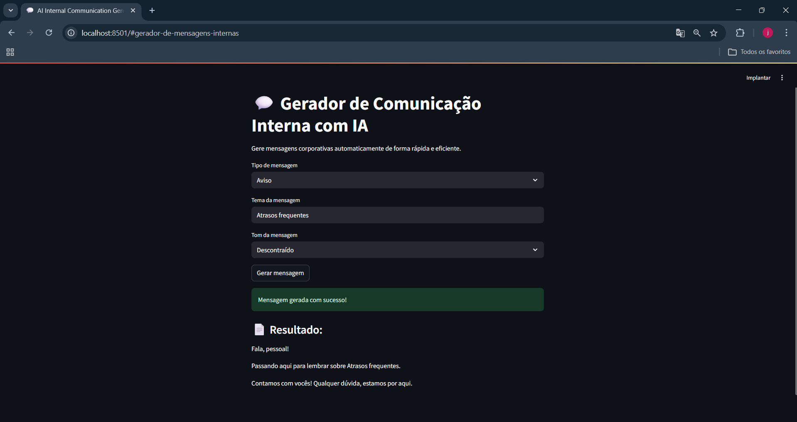

# AI Internal Communication Generator

Aplicação web desenvolvida em Python com Streamlit para geração automática de mensagens internas corporativas.

## Descrição

Este projeto tem como objetivo automatizar a criação de mensagens utilizadas na comunicação interna de empresas, como avisos, lembretes e comunicados. A aplicação simula o uso de inteligência artificial generativa para produzir textos a partir de parâmetros definidos pelo usuário.

## Problema

Empresas frequentemente precisam enviar comunicações internas, o que pode ser repetitivo e consumir tempo das equipes. A falta de padronização também pode impactar a clareza das mensagens.

## Solução

A aplicação permite gerar mensagens automaticamente com base em três entradas principais:
- Tipo de mensagem (aviso, lembrete ou motivacional)
- Tema
- Tom de comunicação (formal ou descontraído)

Com essas informações, o sistema produz uma mensagem estruturada pronta para uso.

## Funcionalidades

- Geração automática de mensagens internas  
- Personalização por tipo, tema e tom  
- Interface web simples e interativa  
- Simulação de uso de inteligência artificial generativa  

## Tecnologias utilizadas

- Python  
- Streamlit  

## Estrutura do projeto

ai-internal-communication-generator/  
│  
├── app.py  
├── requirements.txt  
├── README.md  
├── .gitignore  
│  
└── images/  
    ├── home.png  
    └── result.png  

## Demonstração

### Tela inicial  


### Resultado gerado  


## Como executar o projeto

1. Clone o repositório:

```bash
git clone https://github.com/seu-usuario/ai-internal-communication-generator.git
```

2. Acesse a pasta do projeto:

```bash
cd ai-internal-communication-generator
```

3. Instale as dependências:

```bash
pip install -r requirements.txt
```

4. Execute a aplicação:

```bash
streamlit run app.py
```

5. Acesse no navegador:

http://localhost:8501

## Arquitetura

O sistema é composto por três partes principais:

- Interface: construída com Streamlit para interação com o usuário  
- Lógica: responsável pela geração das mensagens com base nas entradas  
- Saída: exibição do conteúdo gerado na interface  

## Possíveis melhorias

- Integração com APIs de modelos de linguagem
- Personalização por identidade de empresa  
- Histórico de mensagens geradas  
- Exportação de mensagens em diferentes formatos  
- Deploy em ambiente online  

## Autora

Júlia Alves Nunes